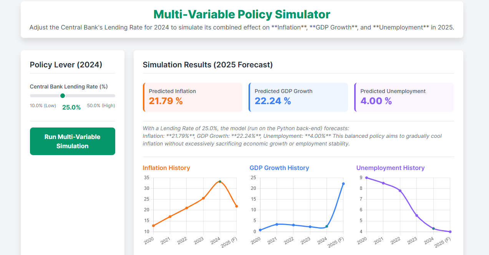

# Multi-Variable Economic Policy Simulator

This project demonstrates a complete end-to-end data science pipeline, from data preparation and model training to the deployment of an interactive, data-driven web application. The application simulates the effects of a Central Bank's lending rate policy on key economic indicators: **Inflation**, **GDP Growth**, and the **Unemployment Rate**.

## Key Features

-   **Data-Driven Modeling:** Utilizes a real-world dataset of macroeconomic indicators to train predictive machine learning models.
-   **End-to-End Pipeline:** Showcases a complete workflow from raw data to a deployed web application.
-   **Multi-Variable Prediction:** The simulator runs three distinct predictive models to forecast Inflation, GDP, and Unemployment in a single action.
-   **Interactive Web Application:** A simple, intuitive web interface built with **Flask** and **HTML/JavaScript** that allows a user to adjust a "policy lever" (the lending rate) and see the immediate forecasted results.
-   **Model-in-Production Simulation:** The Flask back-end acts as a REST API, providing predictions from the trained models, mimicking a production environment.
-   **Consistent & Scalable Architecture:** The models are saved as `joblib` files and loaded via a robust `Pipeline` that includes feature scaling, ensuring consistency between training and prediction.

## Project Structure

The project is organized into logical directories to separate concerns and ensure clarity.

<pre lang="markdown">
PolicySimulator/
├── 1_data/
│   ├── raw/
        └── cbn_interest_rates.csv
│   │   └── cbn_interest_rates.pdf
        └── nbs_cpi_june_2025.pdf        # The raw, unprocessed data
│   └── processed/
        └── cleaned_cbn_interest_rates.csv
│       └── master_economic_data.csv # Merged and cleaned data
        └── nbs_cpi_data.csv
        └── world_bank_data.csv
├── 2_models/
│   ├── inflation_ridge_model.pkl    # Trained model for Inflation
│   ├── gdp_ridge_model.pkl          # Trained model for GDP Growth
│   └── unemployment_ridge_model.pkl # Trained model for Unemployment
├── 3_app/
│   ├── app.py                     # The Flask application backend
│   └── policy_simulator_flask.html  # The web front-end
└── 4_notebooks/
├── data_preparation.py        # Script for data cleaning and merging
└── train_all_models.py      # Script for training all three predictive models
</pre>

## Getting Started

Follow these steps to set up and run the economic policy simulator on your local machine.

### Prerequisites

-   Python 3.8+
```bash
-   `pip` (Python package installer)
```
### Installation

1.  **Clone the Repository:**
    ```bash
    git clone [https://github.com/HenryMorganDibie/policysimulator.git](https://github.com/your-username/PolicySimulator.git)
    cd PolicySimulator
    ```

2.  **Create and Activate a Virtual Environment:**
    ```bash
    python -m venv .venv
    # On Windows:
    .\.venv\Scripts\activate
    # On macOS/Linux:
    source .venv/bin/activate
    ```

3.  **Install Dependencies:**
    ```bash
    pip install pandas scikit-learn Flask joblib
    ```

### Usage

The simulator is run in two stages: first, the data pipeline and model training, and then the web application.

1.  **Run the Data Pipeline:**
    Execute the data preparation script to clean and merge the raw data.
    ```bash
    python 4_notebooks/data_preparation.py
    ```

2.  **Train the Predictive Models:**
    Run the model training script to generate the three `.pkl` model files in the `2_models` directory.
    ```bash
    python 4_notebooks/retrain_all_models.py
    ```

3.  **Start the Flask Web Application:**
    Navigate to the `3_app` directory and start the Flask server.
    ```bash
    python 3_app/app.py
    ```

4.  **Access the Simulator:**
    Open your web browser and navigate to the following address:
    ```
    [http://127.0.0.1:5000/](http://127.0.0.1:5000/)
    ```

You can now interact with the simulator by adjusting the lending rate and observing the forecasted impact on the economy.

## Model & Methodology

The simulator uses three separate **Ridge Regression** models, one for each target variable (Inflation, GDP Growth, and Unemployment Rate). The models are trained using a `Pipeline` that first applies a `StandardScaler` to the input features, which include the current lending rate and the lagged values of the economic indicators.

-   **Features (X):** Lending Interest Rate, Lagged Inflation, Lagged Unemployment Rate, Lagged GDP Growth.
-   **Targets (y):** Annual Inflation, Annual GDP Growth, Annual Unemployment Rate.

This approach ensures consistency and robustness in the predictions.

---
# Technical Deep Dive: My End-to-End MLOps Policy Simulator  

This project represents a full-cycle journey, moving from messy, disparate raw data to a production-ready, interactive web application. I structured the entire workflow following rigorous **MLOps principles**, ensuring the solution is robust, repeatable, and maintainable.  

---

## 1. Phase I: Data Sourcing and Engineering (The Core Challenge)  

My first and most critical challenge was building a clean, reliable foundation from highly unstructured economic data. I aggregated data from three primary public sources:  
- **Central Bank (CBN)**  
- **National Bureau of Statistics (NBS)**  
- **World Bank (WB)**  

### Data Acquisition and ETL (Extract, Transform, Load)  

- **Extraction from Unstructured Sources:**  
  A significant amount of the raw data, particularly historical interest rates and specific CPI figures, was contained within complex web tables or government PDF documents.  
  I wrote Python routines to handle this initial extraction, carefully parsing and moving the data into manageable CSVs in my `1_data/raw` directory.  

- **The Frequency Mismatch Problem:**  
  My raw files had vastly different time steps:  
  - Monthly (interest rates)  
  - Quarterly (unemployment)  
  - Annual (GDP)  

  To solve this, I designed `data_merging_script.py` to:  
  1. **Frequency Consolidation:** Downsample monthly/quarterly data into a single annual time-series frame.  
  2. **Alignment and Joining:** Use **year** as the primary key for an inner join, ensuring the final `master_economic_data.csv` only contained complete yearly records (2002–2023).  

### Exploratory Data Analysis (EDA) and Feature Insights  

- **Temporal Integrity:** Verified sequence correctness for time-series forecasting.  
- **Volatility & Collinearity:** Observed high volatility in Lending Interest Rate and Annual Inflation. Opted for **Ridge Regression** (L2 regularization) to stabilize coefficients and handle collinearity.  
- **Feature Engineering (Autoregressive Lagging):**  
  Structured the dataset so the model predicts year *t* using year *t−1* data:  

"Forecast(t) ~ f(Policy(t−1), Inflation(t−1), GDP(t−1), Unemployment(t−1))"


Final feature vector (**X**) consisted of these four lagged inputs.  

---

## 2. Phase II: Machine Learning Engineering and Model Persistence  

The focus was on building resilient models that transition seamlessly into production.  

### The Production-Ready Pipeline  

I used the **Scikit-learn Pipeline** for all models (Inflation, GDP, Unemployment):  
- **Feature Scaling:** `StandardScaler` ensured features (e.g., GDP in 10¹⁰ scale) did not overshadow rates.  
- **Serialization:** Used `joblib` to serialize pipeline (scaler + model) into `.pkl` files. This guarantees identical transformations during training and live inference, eliminating training/serving skew.  

### Model Performance and Evaluation  

I trained three independent **Ridge Regression** models:  

| Target Variable    | Algorithm      | Core Performance Metric (MSE) | Technical Conclusion |
|--------------------|----------------|-------------------------------|----------------------|
| **Unemployment**   | Ridge (Scaled) | ≈ **0.13**  | Exceptionally accurate; lagged features capture unemployment’s slow-moving nature. |
| **Inflation**      | Ridge (Scaled) | ≈ **13.34** | Stable baseline forecast. Errors suggest missing external volatility factors. |
| **GDP Growth**     | Ridge (Scaled) | ≈ **316.67** | High MSE confirms GDP prediction is influenced by external/non-linear shocks. |

---

## 3. Phase III: Application Architecture and Deployment  

The final stage was transforming models into a **functional, user-facing product** with a client-server setup.  

### Flask API Gateway (`3_app/app.py`)  

- **Model Hosting:** On startup, Flask loads all `.pkl` pipelines into memory (zero disk latency).  
- **RESTful Prediction Endpoint:**  
- `/predict` accepts user `lending_rate` (POST request).  
- Server pairs this input with lagged historical data.  
- Runs all three pipelines sequentially.  
- Returns a clean **JSON payload** with forecasts.  

### Interactive Client (`3_app/policy_simulator_flask.html`)  

- **Interface:**  
- Policy Lever (slider) for user input.  
- UI displays historical trends alongside new forecasts.  

- **Asynchronous Communication:**  
- JavaScript `fetch` API enables non-blocking communication with Flask.  

- **Dynamic Visualization:**  
- JSON response updates forecast panels & charts instantly.  
- Creates a **real-time simulation experience**.  

### Simulator Demonstration



---

## Final Note  

This architecture **decouples** the:  
- **Data Science Engine** (Python back-end)  
- **Responsive UI** (HTML/JS front-end)  

Resulting in a **secure, efficient, and professional demonstration** of the complete ML product lifecycle.  


---

## License

This project is open-source and available under the [MIT License](https://opensource.org/licenses/MIT).

## Contact

-   **Henry Dibie** - henrymorgan273@yahoo.com
-   **LinkedIn** - https://www.linkedin.com/in/kinghenrymorgan/